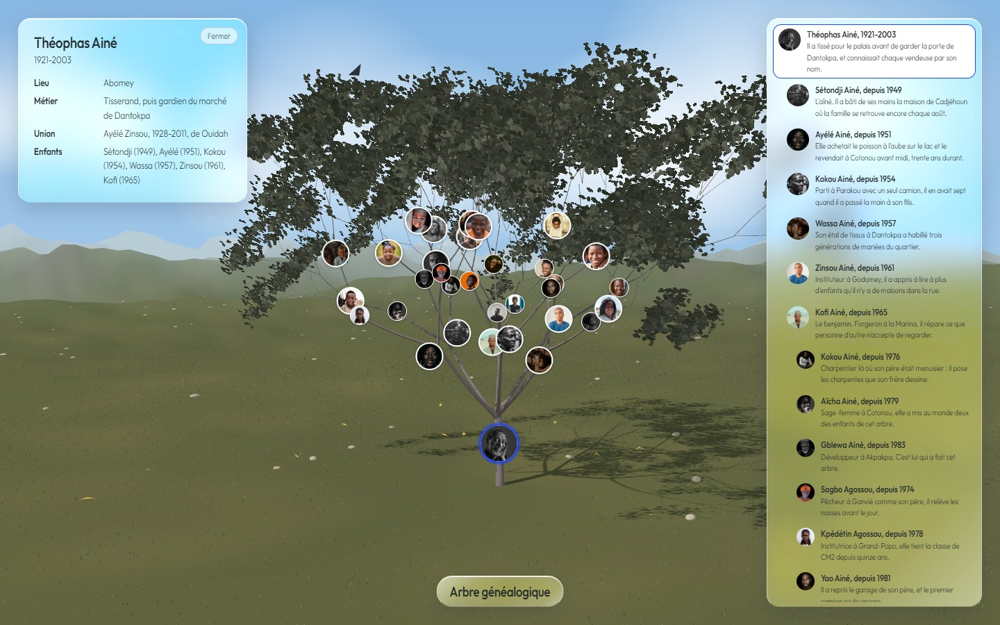

# Arbre généalogique

La famille Théophas Ainé en volume, plantée dans une prairie. Le fût est la
souche, chaque branche est quelqu'un : un enfant au premier rang, un
petit-enfant au deuxième, un arrière-petit-enfant au troisième. Quatre
générations, 33 personnes. On tourne autour au doigt, on s'approche, on touche
un visage pour lire qui c'est.



## Démarrer

Il faut Node 18 ou plus récent.

```
npm install
npm run dev
```

La page s'ouvre sur **http://localhost:5177**. Glissez pour faire le tour de
l'arbre, molette ou deux doigts pour approcher, touchez un visage, une branche
ou une ligne de la légende pour ouvrir la fiche.

Pour voir la version construite, celle qu'on met en ligne :

```
npm run build
npm run preview        # http://localhost:5178
```

`npm run build` écrit tout dans `dist/`. Ce dossier est un site complet et
autonome : il se dépose tel quel sur n'importe quel hébergement statique,
GitHub Pages, Netlify, une clé USB. Il ne demande rien à personne, ce que
`npm run tiers` vérifie.

## Ajouter quelqu'un

Tout se passe dans **`src/genealogie.ts`**. C'est le seul fichier à toucher
pour faire grandir la famille : la forme de l'arbre en découle, elle n'est pas
dessinée à part. L'ossature descend autant de générations que la généalogie en
porte, sans savoir combien il y en a, donc une cinquième ne demande pas une
ligne de code.

```ts
{
  id: 'kossi',                 // unique, sans accent ni espace
  prenom: 'Kossi',
  nom: 'Ainé',
  naissance: 1947,
  lieu: 'Abomey',
  metier: 'Menuisier',
  recit: "Ce qu'on raconte de lui dans la famille, en une phrase.",
  union: { prenom: 'Aké', nom: 'Dossou', naissance: 1950, origine: 'Ouidah' },
  enfants: [ /* la génération suivante, même forme */ ],
}
```

Rangez la fratrie **par âge, l'aîné en premier** : l'ordre du tableau est
l'ordre des branches. L'aîné part le plus bas sur le fût, parce qu'une branche
basse est une branche vieille, et la fratrie se lit de gauche à droite en
tournant par l'avant de l'arbre. Le conjoint n'a pas de branche : il est écrit
dans la fiche de son époux, comme le veut la convention.

Le `recit` n'est pas du remplissage : c'est ce qui s'affiche sous le nom dans
la légende, et c'est ce qu'une famille garde d'un parent quand les dates ne
disent plus rien.

Pour lui donner un visage, ajoutez sa ligne dans `outils/visages.mjs` et
relancez `npm run visages`. Sans ça, son rond s'affiche vide et rien ne casse.

## Comment c'est fait

Aucun fichier 3D, aucune image de texture, aucun service extérieur. Tout est
une recette qui se calcule au chargement.

| fichier | ce qu'il porte |
|---|---|
| `src/genealogie.ts` | la famille, ses récits, et les conventions qui commandent l'arbre |
| `src/squelette.ts` | l'ossature, qui descend autant de générations qu'il y en a |
| `src/bois.ts` | le bois entier, cousu en une seule géométrie |
| `src/matieres.ts` | l'écorce et la feuille, écrites dans des nuanceurs |
| `src/feuillage.ts` | les cartes de feuillage, toutes instanciées |
| `src/vivant.ts` | les nuages, les oiseaux, les papillons, le mouton |
| `src/environnement.ts` | le paysage : il assemble `src/paysage/` et pose l'heure |
| `src/paysage/bruit.ts` | le bruit simplexe et la hauteur du sol |
| `src/paysage/terre.ts` | le terrain, sa rampe de couleurs, les pierres |
| `src/paysage/herbe.ts` | la prairie, une lame dessinée dans le nuanceur |
| `src/paysage/ciel.ts` | la voûte, son dégradé, le champ d'étoiles |
| `src/paysage/meteo.ts` | la pluie, la neige, les flaques, l'éclair |
| `src/paysage/heures.ts` | les quatre heures et les quatre temps |
| `src/decor.ts` | la vue, les gestes, le cadrage, le gardien de cadence |
| `src/etiquettes.ts` | les visages posés au bout des branches |

### Les visages, et pas les noms

Sur l'arbre il n'y a que des ronds. Trente-trois pancartes portant chacune un
nom, deux dates et un conjoint couvraient la moitié de la couronne : on ne
voyait plus l'arbre, on voyait des pancartes. Le nom sort en infobulle au
survol, il est lu par un lecteur d'écran, et tout est écrit dans la légende à
droite, une ligne par personne, décalée selon la génération.

Les visages ne sont pas dans la scène, ce sont des éléments du document : ils
restent nets à tout zoom et ne coûtent aucun appel de dessin.

### Ce qui vit dans le paysage

Des nuages qui dérivent, un vol d'oiseaux, des papillons au-dessus de l'herbe,
un mouton qui marche. Quatre géométries montées à la main, aucun fichier 3D.
Les quatre cadences viennent de mesures publiées :

| | cadence | source |
|---|---|---|
| nuage | 2,5 unités/s | le cumulus dérive à 5 à 10 mph selon la NOAA, soit 2,2 à 4,5 m/s |
| oiseau | 7,6 battements/s | fréquence mesurée en vol libre pour les oiseaux qui alternent battements et plané |
| papillon | 6 battements/s | mesuré sur *Pieris napi* |
| mouton | 1,1 unité/s | allure confortable relevée sur tapis de pression |

Une unité de scène vaut un mètre : l'arbre fait dix mètres, l'herbe vingt
centimètres, le plat s'étend sur cent mètres.

### Le paysage

La prairie, les collines, le ciel et leurs quatre heures sont repris du
composant `Landscape` de [ThreeUI](https://threeui.com/three-js/landscape/noon),
variante `noon`. Repris, pas importé : il n'y a ici **aucune dépendance à
ThreeUI**, ni paquet, ni iframe, ni fichier copié. Leur source a été lue et
réécrite en TypeScript dans `src/paysage/`, module par module, avec les mêmes
teintes, les mêmes bruits et les mêmes nuanceurs.

Trois comptes sont ramenés sous ceux de la source, et chacun est dit en face du
nombre avec ce qu'il coûtait et pourquoi le réduire ne se voit pas d'ici : la
finesse du terrain, le nombre de brins d'herbe, le nombre de pierres. La source
cadre son paysage avec un objectif de dix degrés depuis le ras du sol ; nous
tournons autour d'un arbre à quarante-deux degrés, et ce que ce cadrage-là ne
montre pas n'a pas à être rendu.

Les sept variantes se demandent par l'adresse :

```
?variante=noon      midi clair, celle par défaut
?variante=sunrise   ?variante=sunset   ?variante=night
?variante=rain      ?variante=storm    ?variante=snow
```

L'heure ne change pas que la scène : elle repose aussi les couleurs de la page,
qui viennent de la même table.

### Le verre

Les panneaux sont en verre, au sens où Apple l'entend : translucidité et flou,
clarté remontée, arête qui prend la lumière, reflet spéculaire en biais. Le
cinquième ingrédient, la réfraction, ne s'écrit pas en CSS : aucune fonction de
`backdrop-filter` ne déplace un pixel. Elle a été faite en filtre SVG, puis
retirée : mesurée, elle coûtait 120 ms par image sur la machine de travail,
pour une lentille qu'on ne voyait pas.

### Les visages, d'où ils viennent

Trente-trois portraits, photographies Unsplash, rapatriés dans le dépôt par
`npm run visages` et servis par le site. Aucun n'est appelé chez un tiers à
l'affichage. Les auteurs sont crédités dans `public/visages/PORTRAITS.md`.

## Les contrôles

Ils se lancent sur la version construite, donc après `npm run build` et pendant
que `npm run preview` tourne.

```
npm run interdits      ce qui trahit une interface faite à la machine
npm run tiers          rien ne vient d un domaine tiers
npm run tiers -- --casser
npm run banc           le cout de l image sur la carte graphique
npm run banc -- --saboter
npm run banc -- --sans herbe      (ou terrain, pierres, ciel, meteo, bois, paysage, tout)
npm run gardien        le gardien de cadence se fixe et se tait
```

Chaque contrôle a sa contre-épreuve et tombe quand on la lance : un banc qui ne
peut pas échouer ne mesure rien.

### Ce que ça coûte

Mesuré le 22 septembre 2026 sur une Intel HD Graphics 4600, une carte intégrée
de 2013, en 1440 × 900, au neuvième dixième et non à la moyenne. Les durées sont
lues sur la carte : le banc lit un pixel après chaque image, ce qui l'oblige à
avoir fini.

| | image | triangles | appels |
|---|---|---|---|
| pleine résolution | 68,1 ms | 546 944 | 11 |
| au plancher du gardien | 35,9 ms | | |

Le gardien de cadence mesure le vrai coût d'une image sur dix. Au-dessus de
seize millisecondes il baisse la résolution par paliers jusqu'à trois
cinquièmes, puis lâche la finesse de la carte d'ombre, puis la moitié de
l'herbe, puis le flou du verre, puis se tait pour de bon. Il ne remonte jamais.
Sur une machine qui tient la cadence, il ne touche à rien.

Deux mesures qui ont changé le code plus que n'importe quel raisonnement :

- le flou du verre à 24 pixels de rayon sur trois panneaux faisait passer
  l'image de 68 à 158 ms, et le filtre de réfraction SVG la poussait à 278. Le
  flou est à 12 pixels et la réfraction est partie ;
- le terrain à la finesse de la source coûtait 22,3 ms et l'herbe 21,2 ms, les
  deux postes les plus chers, trouvés en retirant une pièce à la fois.

## Ce qui reste

- 35,9 ms au plancher du gardien, soit vingt-huit images par seconde, au-dessus
  du seuil de vingt millisecondes que la maison se fixe. Le banc le dit et ne le
  cache pas. Le prochain levier serait le feuillage, seize mille cartes en
  découpe alpha, qui n'a pas encore été mesuré seul.
- `ANATOMIE.md` décrit le relevé du baobab, qui commandait la silhouette avant
  que l'arbre ne soit refait à fourches. Ce qu'il dit de l'écorce reste vrai, ce
  qu'il dit du fût et de la couronne ne l'est plus.
- Le mouton traverse la prairie à vingt-six unités du fût : selon l'angle, il
  passe derrière l'arbre et on ne le voit pas de la vue de départ.
